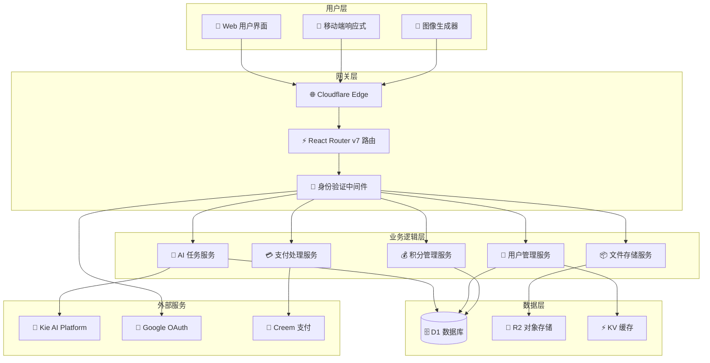
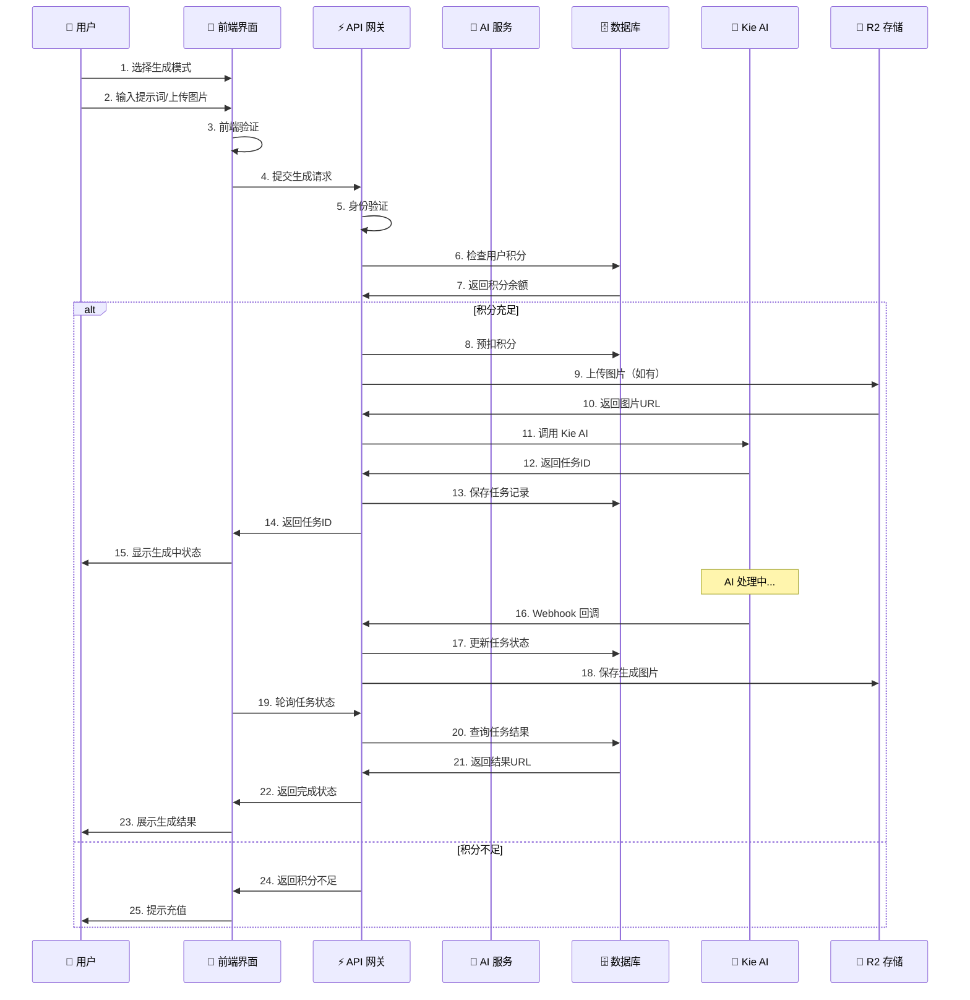
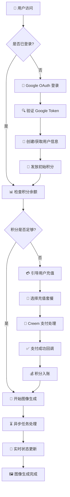
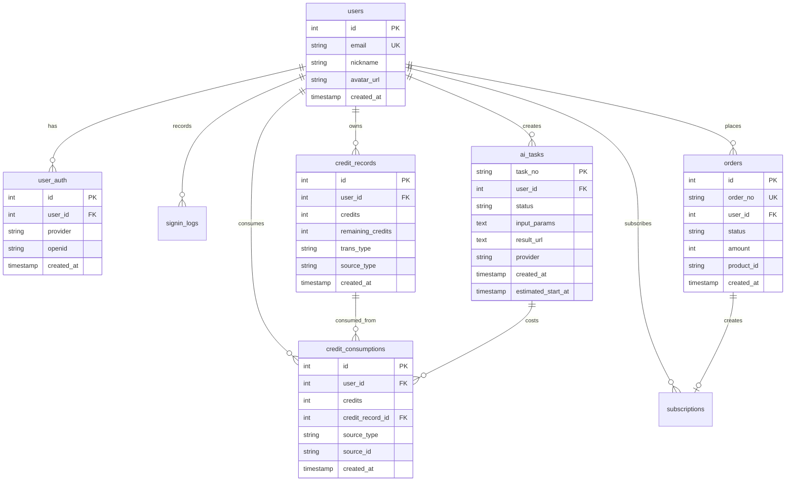

# 🍌 Nano Banana AI 图像生成平台

一个基于 React Router v7 和 Cloudflare Workers 的企业级 AI 图像生成 SaaS 平台，提供完整的商业化解决方案。

## ✨ 核心特性

### 🎨 AI 图像生成能力
- **双模式生成**：Text-to-Image（文字生图）+ Image-to-Image（图片转图）
- **高质量模型**：集成 Google Nano Banana 模型，支持高分辨率图像生成
- **智能优化**：自动提示词优化，提升生成质量
- **批量处理**：支持多张图片同时生成，提升工作效率

### 🏗️ 现代化技术栈
- **前端框架**：React 19.1.1 + React Router v7.8.2 + TypeScript
- **UI 系统**：Tailwind CSS 4.1.4 + DaisyUI 5.0.43 响应式设计
- **构建工具**：Vite 6.3.3 + 热重载开发体验
- **状态管理**：Zustand 5.0.5 轻量级状态管理

### ☁️ 无服务器架构
- **边缘计算**：Cloudflare Workers 全球部署，低延迟响应
- **数据存储**：D1 分布式数据库 + R2 对象存储 + KV 缓存
- **自动扩容**：按需伸缩，支持百万级并发访问
- **成本优化**：按使用量计费，无空闲成本

### 💰 完整商业化功能
- **用户认证**：Google OAuth 2.0 安全登录
- **积分系统**：灵活的积分获取、消费和管理机制
- **支付集成**：Creem 支付平台，支持全球多种支付方式
- **订阅模式**：支持一次性购买和订阅制付费模式

## 🏗️ 系统架构

### 整体架构图



### 技术栈详细

#### 🎨 前端技术
- **React 19.1.1** - 最新 React 框架，支持并发特性
- **React Router v7.8.2** - 全栈路由，SSR + CSR 混合渲染
- **TypeScript 5.8.3** - 类型安全的 JavaScript 超集
- **Tailwind CSS 4.1.4** - 原子化 CSS 框架
- **DaisyUI 5.0.43** - 基于 Tailwind 的组件库
- **Vite 6.3.3** - 高性能构建工具
- **Zustand 5.0.5** - 轻量级状态管理

#### ⚡ 后端技术
- **Cloudflare Workers** - 边缘计算平台，零冷启动
- **D1 Database** - 分布式 SQLite 数据库
- **R2 Object Storage** - 对象存储，CDN 加速
- **KV Store** - 低延迟键值存储
- **Drizzle ORM 0.41.0** - 类型安全的数据库 ORM

#### 🤖 AI 和集成
- **Kie AI API** - Google Nano Banana 模型
- **Google OAuth 2.0** - 企业级身份认证
- **Creem 支付平台** - 全球支付解决方案
- **Web Crypto API** - 端到端加密

## 📁 核心目录结构

```
nanobananimagecursor/
├── 📱 app/                        # React Router v7 应用代码
│   ├── 🔧 .server/               # 服务端代码（仅在服务器运行）
│   │   ├── drizzle/             # 数据库 ORM 和迁移文件
│   │   │   ├── schema.ts        # 数据表结构定义
│   │   │   └── migrations/      # 数据库迁移脚本
│   │   ├── libs/                # 第三方服务集成
│   │   │   ├── creem/          # Creem 支付平台客户端
│   │   │   ├── kie-ai/         # Kie AI 图像生成服务
│   │   │   └── session/        # 会话管理
│   │   ├── services/            # 核心业务逻辑
│   │   │   ├── auth.ts         # 用户认证服务
│   │   │   ├── ai-tasks.ts     # AI 任务管理
│   │   │   ├── credits.ts      # 积分系统
│   │   │   └── order.ts        # 订单处理
│   │   ├── model/              # 数据库模型
│   │   └── utils/              # 服务端工具函数
│   ├── 🎨 components/            # React 组件库
│   │   ├── common/             # 通用组件
│   │   ├── icons/              # SVG 图标组件
│   │   ├── pages/              # 页面组件
│   │   └── ui/                 # UI 基础组件
│   ├── 🎯 features/             # 功能模块
│   │   ├── image_generator/    # 图像生成功能
│   │   ├── layout/             # 布局组件
│   │   └── oauth/              # OAuth 登录
│   ├── 🛣️ routes/              # 路由定义
│   │   ├── _api/               # API 路由
│   │   ├── _webhooks/          # Webhook 路由
│   │   └── base/               # 页面路由
│   └── 📦 store/               # 全局状态管理
├── ☁️ workers/                   # Cloudflare Workers 入口
├── 🚀 .github/workflows/         # CI/CD 自动部署
├── 📋 docs/                      # 项目文档
├── 🗃️ migrations/               # 数据库迁移历史
├── 🧪 test/                     # 测试文件
├── ⚙️ wrangler.jsonc            # Cloudflare 配置
└── 📄 package.json              # 项目依赖和脚本
```

## 🔄 核心业务流程

### AI 图像生成流程



### 用户认证与积分系统



## 🔧 本地开发

### 环境要求
- Node.js 18+ 
- npm 或 yarn
- Cloudflare 账户

### 安装依赖
```bash
npm install
```

### 环境配置
1. 复制环境配置文件
2. 配置必要的 API 密钥：
   - `GOOGLE_CLIENT_ID` - Google OAuth 客户端 ID
   - `GOOGLE_CLIENT_SECRET` - Google OAuth 客户端密钥
   - `KIEAI_APIKEY` - Kie AI API 密钥
   - `SESSION_SECRET` - 会话加密密钥
   - `CREEM_KEY` - 支付系统密钥

### 数据库设置
```bash
# 创建数据库
npx wrangler d1 create nanobanana

# 运行迁移
npx wrangler d1 migrations apply nanobanana --local
```

### 启动开发服务器
```bash
npm run dev
```

访问 http://localhost:3004 查看应用

## 🚀 部署

### 自动部署
项目配置了 GitHub Actions 自动部署，推送到 main 分支即可自动部署到生产环境。

详细配置请查看 [部署指南](./DEPLOY_GUIDE.md)

### 手动部署
```bash
# 构建项目
npm run build

# 部署到 Cloudflare Workers
npx wrangler deploy
```

## 🔑 环境变量配置

### 必需的密钥（使用 wrangler secret put 设置）
```
wrangler secret put GOOGLE_CLIENT_ID
wrangler secret put GOOGLE_CLIENT_SECRET
wrangler secret put KIEAI_APIKEY
wrangler secret put SESSION_SECRET
wrangler secret put CREEM_KEY
wrangler secret put CREEM_WEBHOOK_SECRET
```

### 公开变量（在 wrangler.jsonc 中配置）
- `INITLIZE_CREDITS` - 新用户初始积分
- `DOMAIN` - 应用域名
- `CDN_URL` - CDN 地址
- `GOOGLE_ANALYTICS_ID` - Google Analytics ID
- `GOOGLE_ADS_ID` - Google Ads ID

## 🗄️ 数据库架构

### 核心数据表



### 积分系统设计

| 交易类型 | 说明 | 积分变化 |
|---------|------|---------|
| `initialize` | 新用户注册赠送 | +3 积分 |
| `purchase` | 购买积分包 | +变动积分 |
| `subscription` | 订阅赠送 | +变动积分 |
| `consumption` | AI 图像生成消耗 | -1 积分/图 |

## 📱 功能特性

### 🎨 AI 图像生成
1. **Text-to-Image（文字生图）**
   - 智能提示词优化，提升生成质量
   - 支持多种艺术风格（写实、卡通、艺术等）
   - 自定义图像尺寸（1:1, 16:9, 9:16 等）
   - 高分辨率输出（最高 2048x2048）

2. **Image-to-Image（图片转图）**
   - 支持 JPEG/PNG/WEBP 格式上传
   - 基于参考图片生成变体
   - 风格迁移和内容保持
   - 智能背景替换

### 👥 用户管理系统
- **Google OAuth 2.0** 一键安全登录
- **用户画像** 积分余额、使用历史统计
- **任务中心** 实时查看生成进度和历史记录
- **个人设置** 偏好配置和账户管理

### 💰 商业化功能
- **灵活积分系统** 按需付费，无月费压力
- **Creem 支付集成** 支持全球180+国家支付方式
- **多种充值套餐** 从入门到专业的不同价位选择
- **订阅计划** 高频用户的成本优化方案

## 🔌 API 接口

### 认证相关
```typescript
// 用户登录
POST /api/auth
{
  "type": "google",
  "data": {
    "credential": "google_jwt_token"
  }
}

// 获取用户信息
GET /api/auth
Response: {
  "profile": {
    "name": "用户名",
    "email": "user@example.com",
    "avatar": "头像URL",
    "created_at": 1640995200000
  },
  "credits": 15
}

// 用户登出
DELETE /api/auth
```

### 图像生成
```typescript
// 创建图像生成任务
POST /api/create.ai-image
{
  "mode": "text-to-image" | "image-to-image",
  "prompt": "提示词",
  "type": "nano-banana" | "nano-banana-edit",
  "width": 1024,
  "height": 1024,
  "image": File // 仅 image-to-image 模式
}

// 查询任务状态
GET /api/task/{task_no}
Response: {
  "task_no": "task_xxx",
  "status": "pending" | "processing" | "completed" | "failed",
  "result_url": "生成图片URL",
  "created_at": "2024-01-01T00:00:00Z"
}
```

### 支付相关
```typescript
// 创建订单
POST /api/create-order
{
  "type": "once",
  "product_id": "credits_10",
  "product_name": "10积分包",
  "price": 2.99
}

// Webhook回调
POST /api/webhooks/payment
POST /api/webhooks/kie-image
```

## 🔒 安全与性能

### 🛡️ 安全保障
- **端到端加密** HTTPS + TLS 1.3 全链路加密
- **身份验证** JWT + Session 双重验证机制
- **CSRF 防护** 防止跨站请求伪造攻击
- **输入验证** 严格的参数校验和类型检查
- **权限控制** 基于用户角色的访问控制
- **数据隔离** 多租户数据完全隔离
- **安全审计** 完整的操作日志和监控

### ⚡ 性能优化
- **全球CDN** Cloudflare 200+ 节点加速
- **边缘计算** 就近处理，平均响应时间 < 100ms
- **智能缓存** KV + R2 多层缓存策略
- **异步处理** AI 任务异步化，避免阻塞
- **资源优化** 图片压缩、懒加载、代码分割
- **数据库优化** 连接池、索引优化、读写分离

## 🐛 故障排除

### 常见问题

1. **React Router Context 错误**
   ```bash
   rm -rf .react-router build node_modules/.cache
   npm install
   ```

2. **Cloudflare Workers 全局作用域错误**
   - 检查是否在全局使用了浏览器 API
   - 确保 setInterval/setTimeout 在函数内使用

3. **HMAC 密钥错误**
   - 确保 SESSION_SECRET 已正确设置
   - 使用 `wrangler secret put SESSION_SECRET`

### 日志查看
```
# 查看 Workers 日志
npx wrangler tail

# 查看本地开发日志
npm run dev
```

## 🤝 贡献指南

1. Fork 项目
2. 创建功能分支 (`git checkout -b feature/AmazingFeature`)
3. 提交更改 (`git commit -m 'Add some AmazingFeature'`)
4. 推送到分支 (`git push origin feature/AmazingFeature`)
5. 打开 Pull Request

## 🚀 项目亮点

### 💡 技术创新
- **React Router v7** 最新全栈框架，SSR + CSR 完美结合
- **Cloudflare Workers** 边缘计算，全球零延迟部署
- **TypeScript 全覆盖** 编译时类型检查，减少运行时错误
- **现代化工具链** Vite 6.3 + Tailwind 4.1 极速开发体验

### 🎯 商业价值
- **完整 SaaS 架构** 用户管理、支付、积分一体化
- **全球化支持** 180+ 国家支付，多语言扩展能力
- **高性能 AI** Google Nano Banana 模型，生成质量优异
- **成本可控** Serverless 架构，按使用量精确计费

### 📈 可扩展性
- **模块化设计** 功能组件独立，易于维护和扩展
- **多模型支持** 可轻松集成其他 AI 图像生成服务
- **插件化架构** 支付、认证、存储可独立替换
- **监控完善** 完整的日志、错误追踪和性能监控

## 📝 版本历史

### v1.0.0 (2024-12-XX) - 正式版
- ✅ 完整的 AI 图像生成功能（Text-to-Image + Image-to-Image）
- ✅ Google OAuth 用户认证系统
- ✅ 灵活的积分管理和支付系统
- ✅ Cloudflare Workers 生产部署
- ✅ 响应式 UI 和现代化交互体验
- ✅ 完整的错误处理和日志监控

### 🔮 后续规划
- 🔄 **v1.1** 多模型支持（Flux、DALL-E 等）
- 🔄 **v1.2** 批量处理和工作流功能
- 🔄 **v1.3** 社区功能和作品分享
- 🔄 **v1.4** API 开放平台和开发者工具

## 📄 开源协议

本项目采用 MIT 许可证 - 查看 [LICENSE](LICENSE) 文件了解详情

## 🔗 相关资源

### 📚 技术文档
- [Cloudflare Workers 开发指南](https://developers.cloudflare.com/workers/)
- [React Router v7 官方文档](https://reactrouter.com/)
- [Drizzle ORM 使用指南](https://orm.drizzle.team/)
- [Kie AI API 文档](https://www.kie.ai/)

### 🛠️ 开发工具
- [Tailwind CSS 设计系统](https://tailwindcss.com/)
- [DaisyUI 组件库](https://daisyui.com/)
- [TypeScript 类型定义](https://www.typescriptlang.org/)

## 📞 技术支持

### 🆘 获取帮助
1. 📖 **查看文档** - 首先查看 [项目文档](./docs/) 和 [部署指南](./DEPLOY_GUIDE.md)
2. 🐛 **报告问题** - 在 [GitHub Issues](../../issues) 创建问题报告
3. 💬 **社区讨论** - 加入项目讨论，分享使用经验
4. 📧 **技术咨询** - 企业用户可联系技术支持

### 🤝 贡献代码
欢迎提交 Pull Request！请遵循：
1. Fork 项目并创建功能分支
2. 编写测试用例确保代码质量
3. 更新相关文档
4. 提交 PR 并描述变更内容

---

**⚠️ 生产部署提醒**：
这是一个企业级应用，部署前请确保：
- ✅ 所有环境变量正确配置
- ✅ 数据库迁移完成
- ✅ 支付和 AI 服务密钥有效
- ✅ CDN 和域名配置正确
可以直接通过git部署

*最后更新：2024年12月 | 基于 MCP 思维分析的完整架构文档*
