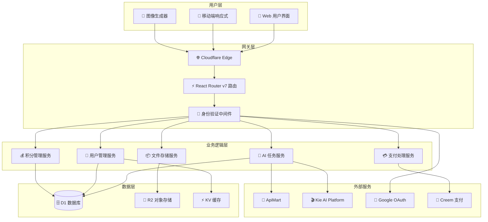
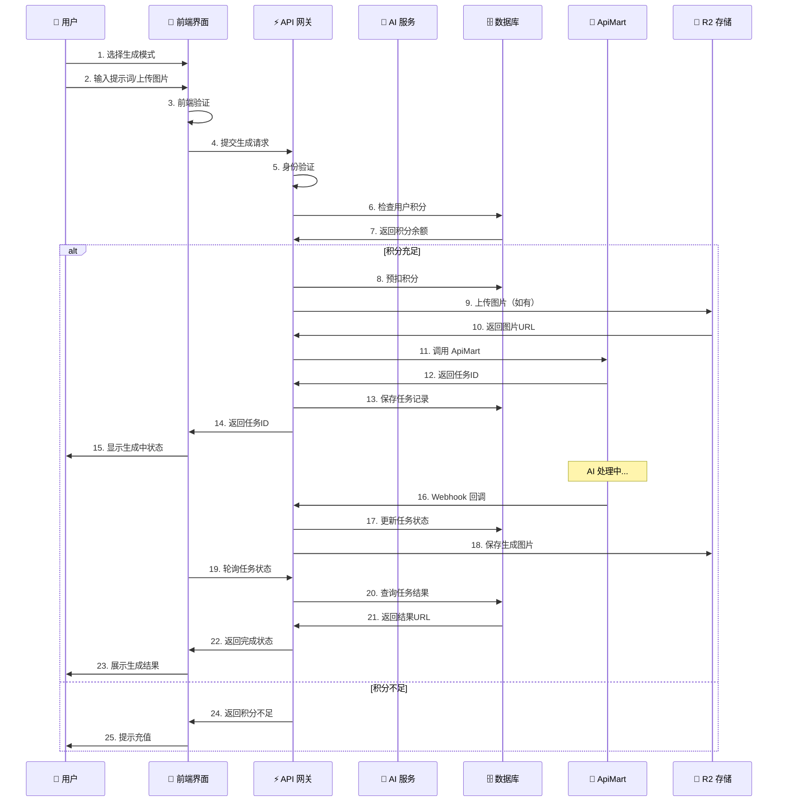
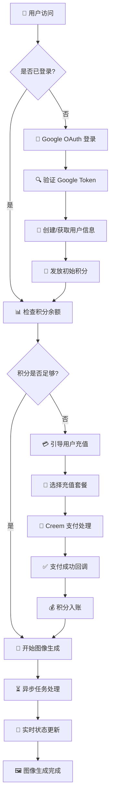
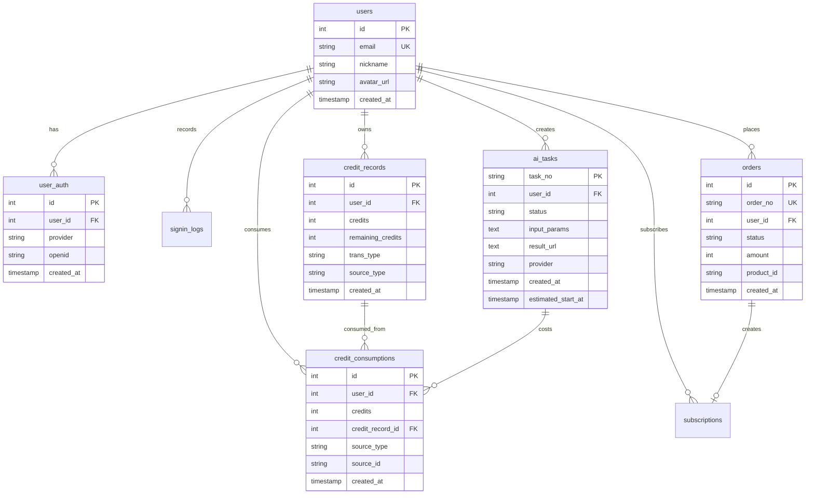

# 🍌 Nano Banana AI 图像生成平台

一个基于 React Router v7 和 Cloudflare Workers 的企业级 AI 图像生成 SaaS 平台，提供完整的商业化解决方案。

## 🌐 在线演示

**🔗 立即体验**: [https://nanobananaimage.org](https://nanobananaimage.org)

- 💡 **Text-to-Image**: 输入文字描述生成精美图像
- 🖼️ **Image-to-Image**: 上传图片进行AI智能编辑
- 🎬 **AI Video**: 支持 Seedance 2.0、HappyHorse 1.0 与 Seedance 1.5 Pro 视频生成
- 🆓 **免费试用**: 新用户注册即获60个免费积分
- ⚡ **即时生成**: 30-120秒完成高质量图像生成

## 📝 最新进展（2026-05-17）

### 最近完成的工作

- **完成转化导向 UI 调整**：参考 `nanobanana.io` 的页面结构后，首页改为 `Launch offer` 提示条、深色品牌 hero、明确的 `Start creating free` / `View pricing` CTA，并保留首屏下方生成器入口。
- **优化生成器空状态**：图片结果区从纯空状态改为三组可点击 sample prompt，用户可一键填充提示词再微调，降低首次生成门槛。
- **统一视觉系统**：全站主要交互从大面积紫色渐变收敛为 slate/neutral + amber accent，充值弹窗、Pricing、图片/视频生成器、模型页 FAQ 采用更一致的生产工具视觉。
- **优化 Pricing 和充值体验**：Pricing 增加年度优惠说明和 credits 覆盖能力提示；充值弹窗改为更克制的深色顶部，并保持小屏滚动可用。
- **模型内页继续收敛**：`/model/gpt-image-2` 与 `/model/happyhorse-1-0` 修复固定导航遮挡，保留媒体 hero + 生成器 + 信息摘要 + FAQ 的基础结构，后续继续补案例、对比和更深 SEO 内容。
- **安装项目级 UI 审查 skills**：已通过 `npx skills add` 安装 `frontend-design` 与 `redesign-existing-projects`，保存在 `.agents/skills/` 与 `skills-lock.json`，用于后续页面设计和改版审查。
- **图片生成供应商切换到 ApiMart**：新增 ApiMart 图像客户端，`nano-banana` / `nano-banana-edit` / `nano-banana-2` / `nano-banana-pro` 统一走 `https://api.apimart.ai/v1/images/generations` 异步任务接口，旧 `kie_nano_banana` 查询分支保留用于历史任务兼容。
- **新增 Nano Banana Pro 入口**：前端模型下拉已加入 `Nano Banana Pro`，与 Nano Banana 2 一样支持 1K/2K/4K 和最多 14 张参考图，积分档位统一为 50 / 80 / 120。
- **新增 GPT Image 2 试点接入**：新增公共模型 catalog 与 `/model/gpt-image-2` 独立内页，`POST /api/create.ai-image` 支持 `type/model: "gpt-image-2"`，走 ApiMart `/v1/images/generations`，支持文生图、图生图、最多 16 张参考图、`auto` 与多种比例、1K/2K/4K 输出和 4K 比例限制。
- **ApiMart Seedance 2.0 已接入视频生成**：`doubao-seedance-2.0` / `doubao-seedance-2.0-fast` / `doubao-seedance-2.0-face` / `doubao-seedance-2.0-fast-face` 走 ApiMart，`seedance-1.5-pro` 继续走 Kie 兼容路径。
- **新增 HappyHorse 1.0 试点接入**：新增 `/model/happyhorse-1-0` 独立内页，`POST /api/create/ai-video` 支持 `model: "happyhorse-1.0"`，走 ApiMart `/v1/videos/generations`，支持 Text-to-Video、Image-to-Video、Reference-Image-to-Video、Video Edit 四种模式。
- **新增视频上传能力**：新增 `/api/upload/media`，登录后可上传 MP4 / MOV 源视频到 R2，最大 100MB，用于 HappyHorse Video Edit。
- **优化生成按钮交互**：图片和视频生成按钮不再因为积分不足或缺参考素材直接置灰；只要提示词有效即可点击，点击后会刷新用户积分，积分不足弹出充值弹窗，缺少必需参考图/源视频时展示明确校验提示。
- **新增 Seedance 2.0 素材 API**：新增 `/api/seedance2/private-avatar` 与 `/api/seedance2/real-avatar`，先提供后端提交、审核任务入库和状态轮询能力，前台素材管理 UI 后续再补。
- **完善视频任务轮询和失败回滚**：ApiMart `pending` / `processing` 映射为 running，`completed` 解析 `result.videos` 和 `result.thumbnail_url`，生产环境复制视频到 R2，失败或缺失结果 URL 会回滚已扣积分。
- **积分规则更新**：GPT Image 2 按 Nano Banana 的 `$0.0125 / 30 credits` 基准换算，1K/2K/4K 为 15 / 25 / 40 credits；HappyHorse 1.0 按 Seedance 2.0 秒价比例换算，原生音频不额外加价；Seedance 2.0 四个模型继续按现有视频公式的 `1.5x` 计费。
- **Seedance 2.0 已完成测试与正式环境验证**：测试 Worker `nanobanana-test` 已发布版本 `f7317bbf-17c5-49e5-9a46-7edf21870e25`；正式 Worker `nanobanana` 已发布版本 `240278b4-cade-495c-a13f-8ef180af6db1`，正式站点为 `https://nanobananaimage.org`。
- **生成按钮交互修复已发布正式环境**：正式 Worker `nanobanana` 已发布版本 `e199b6b5-e917-42dc-a760-69627fd6c1f6`，已验证首页、`/model/gpt-image-2` 与 `/model/happyhorse-1-0` 返回 HTTP 200。
- **转化 UI 优化已发布正式环境**：正式 Worker `nanobanana` 已发布版本 `1a794a19-3a46-4b35-90c1-9a10db94574b`，本轮包含首页 hero/offer、生成器 sample prompt、Pricing/recharge 视觉、项目 skills 与文档同步。
- **补充试点回归测试**：新增模型 catalog、GPT Image 2、HappyHorse 1.0、图片/视频模型配置与积分测试；`npx vitest run test/model-catalog.test.ts test/apimart-image.test.ts test/apimart-video.test.ts test/image-model-config.test.ts test/video-model-config.test.ts test/video-credits.test.ts` 当前通过。

### 接下来的待办

- **彻底隔离测试环境与正式环境资源**：当前测试环境虽然已切到测试域名、测试数据库和 Creem Test API，但 `KV` / `R2` 仍未完全隔离。
- **继续深化模型内页转化内容**：参考 `nanobanana.io`，为 GPT Image 2、HappyHorse、Seedance 2.0 等页面补 `Why choose`、使用步骤、样例 gallery、模型对比、Prompt examples、底部 CTA 和更强内部链接。
- **规划独立 `/create` 工作台**：首页负责说服和转化，`/create` 可作为更专注的生成器工作台，供导航、模型页和广告落地页统一跳转。
- **把模型 catalog 扩展为完整模型市场**：当前只试点 `gpt-image-2` 和 `happyhorse-1.0` 两个独立内页，后续批量接入 ApiMart 图片/视频模型时继续沿用 catalog + adapter + model page 模式。
- **补齐 entitlement 权限系统**：套餐文案里的 `No Captcha verification`、`priority queue`、`private` 等权益目前仍是展示层描述，后端尚未按 `plan_type` 落地能力控制。
- **补齐 ApiMart 真实链路监控**：生产已上线 ApiMart 图片与 Seedance 2.0 视频；GPT Image 2 / HappyHorse 1.0 试点代码已完成本地测试，发布后需要继续关注任务失败率、余额/权限错误、结果链接复制到 R2 的成功率，以及素材审核任务状态。
- **补订阅与生成链路测试**：为首购、续费、退款、取消、过期，以及 ApiMart 图片/视频创建任务、查询任务、失败回滚继续补服务层或 webhook 测试。
- **清理历史兼容代码**：`guest_credit_usage`、`hasUsedGuestCredit` 和旧 Kie 图片任务兼容分支仍保留，后续可按线上历史任务消化情况逐步收敛。
- **修复仓库现存类型检查问题**：当前 `npm run typecheck` 仍会被若干历史问题阻塞，例如 Google OAuth `ux_mode` 类型、`use-error-handler` 积分弹窗类型、`THIRD_PARTY_ADS_ID` Env 类型、部分 route typegen 文件和旧别名引用，和本轮 UI/文档更新无直接关系，但建议单独清理。

### 当前状态结论

- 当前代码规则已经收敛为：**登录送 60 Credits、上传与生成都要求登录、图片生成走 ApiMart、Seedance 2.0 与 HappyHorse 1.0 视频走 ApiMart、Seedance 1.5 Pro 走 Kie、生成按钮点击后再校验积分/必需素材、订阅积分按计费周期发放**。
- 当前前端策略已经收敛为：**首页先建立价值与信任，再把用户引导到生成器；生成器空状态展示可复用样例；充值和 Pricing 更偏购买决策辅助，而不是纯套餐列表**。
- 当前环境区分方式为：**测试环境使用 `wrangler.test.jsonc` + `CREEM_TEST_KEY` + 测试数据库**，正式环境使用 `wrangler.jsonc` + 正式 Creem Key + 正式数据库。
- 当前发布策略仍是手动发布：先 `npm run deploy:test` 验证测试环境，再 `npm run deploy` 发布正式环境。

## ✨ 核心特性

### 🎨 AI 图像生成能力
- **双模式生成**：Text-to-Image（文字生图）+ Image-to-Image（图片转图）
- **高质量模型**：通过 ApiMart 接入 Nano Banana、Nano Banana 2、Nano Banana Pro 与 GPT Image 2，支持高分辨率图像生成
- **AI 视频生成**：Seedance 2.0 标准版、Fast、Face、Fast Face 与 HappyHorse 1.0 走 ApiMart，Seedance 1.5 Pro 保留 Kie 兼容链路
- **清晰的充值体验**：生成按钮保持可点击，点击后刷新余额；积分不足时弹出充值弹窗，缺少参考图/源视频时展示明确提示
- **转化友好的默认体验**：首页提供明确 CTA，生成器默认展示可点击 sample prompt，Pricing 显示 credits 可覆盖的生成能力
- **智能优化**：自动提示词优化，提升生成质量
- **批量处理**：支持多张图片同时生成，提升工作效率

### 🏗️ 现代化技术栈
- **前端框架**：React 19.1.1 + React Router v7.8.2 + TypeScript
- **UI 系统**：Tailwind CSS 4.1.4 + DaisyUI 5.0.43 响应式设计
- **构建工具**：Vite 6.3.3 + 热重载开发体验
- **状态管理**：Zustand 5.0.5 轻量级状态管理

### ☁️ 无服务器架构
- **边缘计算**：Cloudflare Workers 全球部署，低延迟响应
- **数据存储**：D1 分布式数据库 + R2 对象存储 + KV 缓存
- **自动扩容**：按需伸缩，支持百万级并发访问
- **成本优化**：按使用量计费，无空闲成本

### 💰 完整商业化功能
- **用户认证**：Google OAuth 2.0 安全登录
- **积分系统**：灵活的积分获取、消费和管理机制
- **支付集成**：Creem 支付平台，支持全球多种支付方式
- **订阅模式**：支持一次性购买和订阅制付费模式

## 🏗️ 系统架构

### 整体架构图


```mermaid
graph TB
    subgraph "用户层"
        A[👤 Web 用户界面]
        B[📱 移动端响应式]
        C[🎨 图像生成器]
    end
    
    subgraph "网关层"
        D[🌐 Cloudflare Edge]
        E[⚡ React Router v7 路由]
        F[🔐 身份验证中间件]
    end
    
    subgraph "业务逻辑层"
        G[🤖 AI 任务服务]
        H[👥 用户管理服务]
        I[💰 积分管理服务]
        J[📦 文件存储服务]
        K[💳 支付处理服务]
    end
    
    subgraph "数据层"
        L[(🗄️ D1 数据库)]
        M[📁 R2 对象存储]
        N[⚡ KV 缓存]
    end
    
    subgraph "外部服务"
        O[🎯 ApiMart]
        V[🎬 Kie AI Platform]
        P[🔑 Google OAuth]
        Q[💸 Creem 支付]
    end
    
    A --> D
    B --> D
    C --> D
    D --> E
    E --> F
    F --> G
    F --> H
    F --> I
    F --> J
    F --> K
    
    G --> L
    H --> L
    I --> L
    J --> M
    H --> N
    
    G --> O
    G --> V
    F --> P
    K --> Q
```

### 技术栈详细

#### 🎨 前端技术
- **React 19.1.1** - 最新 React 框架，支持并发特性
- **React Router v7.8.2** - 全栈路由，SSR + CSR 混合渲染
- **TypeScript 5.8.3** - 类型安全的 JavaScript 超集
- **Tailwind CSS 4.1.4** - 原子化 CSS 框架
- **DaisyUI 5.0.43** - 基于 Tailwind 的组件库
- **Vite 6.3.3** - 高性能构建工具
- **Zustand 5.0.5** - 轻量级状态管理

#### ⚡ 后端技术
- **Cloudflare Workers** - 边缘计算平台，零冷启动
- **D1 Database** - 分布式 SQLite 数据库
- **R2 Object Storage** - 对象存储，CDN 加速
- **KV Store** - 低延迟键值存储
- **Drizzle ORM 0.41.0** - 类型安全的数据库 ORM

#### 🤖 AI 和集成
- **ApiMart API** - Nano Banana / GPT Image 2 图片模型、Doubao Seedance 2.0 与 HappyHorse 1.0 视频模型
- **Kie AI API** - Seedance 1.5 Pro 与历史任务兼容
- **Google OAuth 2.0** - 企业级身份认证
- **Creem 支付平台** - 全球支付解决方案
- **Web Crypto API** - 端到端加密

## 📁 核心目录结构

```
nanobananimagecursor/
├── 📱 app/                        # React Router v7 应用代码
│   ├── 🔧 .server/               # 服务端代码（仅在服务器运行）
│   │   ├── drizzle/             # 数据库 ORM 和迁移文件
│   │   │   ├── schema.ts        # 数据表结构定义
│   │   │   └── migrations/      # 数据库迁移脚本
│   │   ├── aisdk/              # ApiMart 与 Kie AI provider clients
│   │   ├── libs/               # 第三方服务集成
│   │   │   ├── creem/          # Creem 支付平台客户端
│   │   │   └── session/        # 会话管理
│   │   ├── services/            # 核心业务逻辑
│   │   │   ├── auth.ts         # 用户认证服务
│   │   │   ├── ai-tasks.ts     # AI 任务管理
│   │   │   ├── credits.ts      # 积分系统
│   │   │   └── order.ts        # 订单处理
│   │   ├── model/              # 数据库模型
│   │   └── utils/              # 服务端工具函数
│   ├── 🎨 components/            # React 组件库
│   │   ├── common/             # 通用组件
│   │   ├── icons/              # SVG 图标组件
│   │   ├── pages/              # 页面组件
│   │   └── ui/                 # UI 基础组件
│   ├── 🎯 features/             # 功能模块
│   │   ├── image_generator/    # 图像生成功能
│   │   ├── video_generator/    # 视频生成功能
│   │   ├── layout/             # 布局组件
│   │   └── oauth/              # OAuth 登录
│   ├── 🛣️ routes/              # 路由定义
│   │   ├── _api/               # API 路由
│   │   ├── _webhooks/          # Webhook 路由
│   │   └── base/               # 页面路由
│   └── 📦 store/               # 全局状态管理
├── ☁️ workers/                   # Cloudflare Workers 入口
├── 🧠 .agents/skills/            # 项目级 Codex 设计/改版审查 skills
├── 🔒 skills-lock.json           # Codex skills 锁定文件
├── 🚀 .github/workflows/         # CI/CD 自动部署
├── 📋 docs/                      # 项目文档
├── 🗃️ migrations/               # 数据库迁移历史
├── 🧪 test/                     # 测试文件
├── ⚙️ wrangler.jsonc            # Cloudflare 配置
└── 📄 package.json              # 项目依赖和脚本
```

## 🔄 核心业务流程

### AI 图像生成流程


```mermaid
sequenceDiagram
    participant U as 👤 用户
    participant F as 🎨 前端界面
    participant A as ⚡ API 网关
    participant S as 🤖 AI 服务
    participant D as 🗄️ 数据库
    participant K as 🎯 ApiMart
    participant R as 📁 R2 存储

    U->>F: 1. 选择生成模式
    U->>F: 2. 输入提示词/上传图片
    F->>F: 3. 前端验证
    F->>A: 4. 提交生成请求
    
    A->>A: 5. 身份验证
    A->>D: 6. 检查用户积分
    D->>A: 7. 返回积分余额
    
    alt 积分充足
        A->>D: 8. 预扣积分
        A->>R: 9. 上传图片（如有）
        R->>A: 10. 返回图片URL
        A->>K: 11. 调用 ApiMart
        K->>A: 12. 返回任务ID
        A->>D: 13. 保存任务记录
        A->>F: 14. 返回任务ID
        F->>U: 15. 显示生成中状态
        
        Note over K: AI 处理中...
        K->>A: 16. Webhook 回调
        A->>D: 17. 更新任务状态
        A->>R: 18. 保存生成图片
        
        F->>A: 19. 轮询任务状态
        A->>D: 20. 查询任务结果
        D->>A: 21. 返回结果URL
        A->>F: 22. 返回完成状态
        F->>U: 23. 展示生成结果
    else 积分不足
        A->>F: 24. 返回积分不足
        F->>U: 25. 提示充值
    end
```

### 用户认证与积分系统


```mermaid
flowchart TD
    A[👤 用户访问] --> B{是否已登录?}
    B -->|否| C[🔑 Google OAuth 登录]
    B -->|是| D[📊 检查积分余额]
    
    C --> E[🔍 验证 Google Token]
    E --> F[👥 创建/获取用户信息]
    F --> G[🎁 发放初始积分]
    G --> D
    
    D --> H{积分是否足够?}
    H -->|是| I[🎨 开始图像生成]
    H -->|否| J[💳 引导用户充值]
    
    J --> K[🛒 选择充值套餐]
    K --> L[💸 Creem 支付处理]
    L --> M[✅ 支付成功回调]
    M --> N[💰 积分入账]
    N --> I
    
    I --> O[⏳ 异步任务处理]
    O --> P[📱 实时状态更新]
    P --> Q[🖼️ 图像生成完成]
```

## 🔧 本地开发

### 环境要求
- Node.js 18+ 
- npm 或 yarn
- Cloudflare 账户

### 安装依赖
```bash
npm install
```

### 环境配置
1. 复制环境配置文件
2. 配置必要的 API 密钥：
   - `GOOGLE_CLIENT_ID` - Google OAuth 客户端 ID
   - `GOOGLE_CLIENT_SECRET` - Google OAuth 客户端密钥
   - `APIMART_API_KEY` - ApiMart 图片生成、Seedance 2.0 视频与 HappyHorse 1.0 视频 API 密钥
   - `KIEAI_APIKEY` - Kie AI API 密钥（Seedance 1.5 Pro 与历史任务兼容）
   - `SESSION_SECRET` - 会话加密密钥
   - `CREEM_KEY` - 支付系统密钥

### 数据库设置
```bash
# 创建数据库
npx wrangler d1 create nanobanana

# 运行迁移
npx wrangler d1 migrations apply nanobanana --local
```

### 启动开发服务器
```bash
npm run dev
```

访问 http://localhost:3004 查看应用

## 🚀 部署

### 环境说明

项目分为三个环境，**每次修改代码后必须先部署到测试环境，确认无误再部署到正式环境。**

| 环境 | 命令 | 访问地址 | 数据库 | 配置文件 |
|:---|:---|:---|:---|:---|
| **本地开发** | `npm run dev` | `http://localhost:3004` | 本地 SQLite | `.dev.vars` |
| **测试环境** | `npm run deploy:test` | `https://nanobanana-test.slideology0816.workers.dev` | `nanobanana-test`（测试库） | `wrangler.test.jsonc` |
| **正式环境** | `npm run deploy` | `https://nanobananaimage.org` | `nanobanana`（正式库） | `wrangler.jsonc` |

### 标准部署流程

```
1. 开发 → npm run dev 本地验证
2. 部署测试 → npm run deploy:test
3. 在测试地址验证功能是否正常
4. 确认无误 → npm run deploy 发布正式
```

### 部署测试环境
```bash
npm run deploy:test
# 部署完成后访问：https://nanobanana-test.slideology0816.workers.dev
```

### 部署正式环境（需确认测试通过后执行）
```bash
npm run deploy
# 正式访问地址：https://nanobananaimage.org
```

### 自动部署
目前暂未配置 GitHub Actions 自动化 CI/CD，所有部署均为手动执行。

详细配置请查看 [部署指南](./DEPLOY_GUIDE.md)

## 🔑 环境变量配置

### 必需的密钥（使用 wrangler secret put 设置）
```
wrangler secret put GOOGLE_CLIENT_ID
wrangler secret put GOOGLE_CLIENT_SECRET
wrangler secret put APIMART_API_KEY
wrangler secret put KIEAI_APIKEY
wrangler secret put SESSION_SECRET
wrangler secret put CREEM_KEY
wrangler secret put CREEM_WEBHOOK_SECRET
```

图片生成当前走 ApiMart：`nano-banana` / `nano-banana-edit` 对应 `gemini-2.5-flash-image-preview`，`nano-banana-2` 对应 `gemini-3.1-flash-image-preview`，`nano-banana-pro` 对应 `gemini-3-pro-image-preview`，`gpt-image-2` 对应 ApiMart GPT Image 2。Seedance 2.0 四个模型走 ApiMart：`doubao-seedance-2.0` / `doubao-seedance-2.0-fast` / `doubao-seedance-2.0-face` / `doubao-seedance-2.0-fast-face`。HappyHorse 1.0 走 ApiMart：`happyhorse-1.0`。`KIEAI_APIKEY` 仍用于 Seedance 1.5 Pro，以及查询切换前已创建的 Kie 历史任务。
如需覆盖 ApiMart 网关地址，可额外配置 `APIMART_BASE_URL`；默认值为 `https://api.apimart.ai/v1`。

### 公开变量（在 wrangler.jsonc 中配置）
- `INITLIZE_CREDITS` - 新用户初始积分
- `DOMAIN` - 应用域名
- `CDN_URL` - CDN 地址
- `GOOGLE_ANALYTICS_ID` - Google Analytics ID
- `GOOGLE_ADS_ID` - Google Ads ID

## 🗄️ 数据库架构

### 核心数据表


```mermaid
erDiagram
    users ||--o{ user_auth : "has"
    users ||--o{ signin_logs : "records"
    users ||--o{ ai_tasks : "creates"
    users ||--o{ credit_records : "owns"
    users ||--o{ credit_consumptions : "consumes"
    users ||--o{ orders : "places"
    users ||--o{ subscriptions : "subscribes"
    
    credit_records ||--o{ credit_consumptions : "consumed_from"
    orders ||--o| subscriptions : "creates"
    ai_tasks ||--o{ credit_consumptions : "costs"

    users {
        int id PK
        string email UK
        string nickname
        string avatar_url
        timestamp created_at
    }
    
    user_auth {
        int id PK
        int user_id FK
        string provider
        string openid
        timestamp created_at
    }
    
    ai_tasks {
        string task_no PK
        int user_id FK
        string status
        text input_params
        text result_url
        string provider
        timestamp created_at
        timestamp estimated_start_at
    }
    
    credit_records {
        int id PK
        int user_id FK
        int credits
        int remaining_credits
        string trans_type
        string source_type
        timestamp created_at
    }
    
    credit_consumptions {
        int id PK
        int user_id FK
        int credits
        int credit_record_id FK
        string source_type
        string source_id
        timestamp created_at
    }
    
    orders {
        int id PK
        string order_no UK
        int user_id FK
        string status
        int amount
        string product_id
        timestamp created_at
    }
```

### 积分系统设计

| 交易类型 | 说明 | 积分变化 |
|---------|------|---------|
| `initialize` | 新用户注册赠送 | +60 积分 |
| `purchase` | 购买积分包 | +变动积分 |
| `subscription` | 订阅赠送 | +变动积分 |
| `consumption` | AI 图片/视频生成消耗 | 按模型、分辨率、时长和音频选项计算 |

## 📱 功能特性

### 🎨 AI 图像生成
1. **Text-to-Image（文字生图）**
   - 智能提示词优化，提升生成质量
   - 支持多种艺术风格（写实、卡通、艺术等）
   - 自定义图像尺寸（1:1, 16:9, 9:16 等）
   - 高分辨率输出，GPT Image 2 支持最高 4K

2. **Image-to-Image（图片转图）**
   - 支持 JPEG/PNG/WEBP 格式上传
   - 基于参考图片生成变体
   - 风格迁移和内容保持
   - 智能背景替换
   - GPT Image 2 支持最多 16 张参考图

3. **AI Video（视频生成）**
   - 默认使用 ApiMart Seedance 2.0 标准版
   - 支持 Seedance 2.0 Fast / Face / Fast Face 选项
   - Seedance 1.5 Pro 作为 Kie 兼容模型保留
   - 支持参考图、比例、分辨率、时长和音频开关
   - HappyHorse 1.0 支持 Text-to-Video、Image-to-Video、Reference-Image-to-Video、Video Edit，源视频上传支持 MP4 / MOV，最大 100MB

4. **模型独立内页**
   - `/model/gpt-image-2` 默认打开 GPT Image 2 的 Text-to-Image
   - `/model/happyhorse-1-0` 默认打开 HappyHorse 1.0 的 Text-to-Video
   - 新模型页面通过 `app/constants/model-catalog.ts` 统一维护 SEO、能力、价格和默认模式

### 👥 用户管理系统
- **Google OAuth 2.0** 一键安全登录
- **用户画像** 积分余额、使用历史统计
- **任务中心** 实时查看生成进度和历史记录
- **个人设置** 偏好配置和账户管理

### 💰 商业化功能
- **灵活积分系统** 按需付费，无月费压力
- **Creem 支付集成** 支持全球180+国家支付方式
- **多种充值套餐** 从入门到专业的不同价位选择
- **订阅计划** 高频用户的成本优化方案

## 🔌 API 接口

### 认证相关
```typescript
// 用户登录
POST /api/auth
{
  "type": "google",
  "data": {
    "credential": "google_jwt_token"
  }
}

// 获取用户信息
GET /api/auth
Response: {
  "profile": {
    "name": "用户名",
    "email": "user@example.com",
    "avatar": "头像URL",
    "created_at": 1640995200000
  },
  "credits": 15
}

// 用户登出
DELETE /api/auth
```

### 图像生成
```typescript
// 创建图像生成任务
POST /api/create.ai-image
{
  "mode": "text-to-image" | "image-to-image",
  "prompt": "提示词",
  "type": "nano-banana" | "nano-banana-edit" | "nano-banana-2" | "nano-banana-pro" | "gpt-image-2",
  "model": "gpt-image-2", // 可选，优先级高于 type
  "width": 1024,
  "height": 1024,
  "aspect_ratio": "auto" | "1:1" | "16:9" | "9:16" | "21:9",
  "resolution": "1K" | "2K" | "4K",
  "image": "https://example.com/reference.png", // 兼容旧单图字段
  "image_urls": ["https://example.com/reference.png"] // GPT Image 2 最多 16 张
}

// 查询任务状态
GET /api/task/{task_no}
Response: {
  "task_no": "task_xxx",
  "status": "pending" | "processing" | "completed" | "failed",
  "result_url": "生成图片URL",
  "created_at": "2024-01-01T00:00:00Z"
}
```

### 视频生成
```typescript
// 创建 Seedance 视频任务
POST /api/create/ai-video
{
  "model": "doubao-seedance-2.0" | "doubao-seedance-2.0-fast" | "doubao-seedance-2.0-face" | "doubao-seedance-2.0-fast-face" | "seedance-1.5-pro" | "happyhorse-1.0",
  "prompt": "视频提示词",
  "input_urls": ["https://example.com/reference.png"],
  "aspect_ratio": "16:9" | "9:16" | "1:1" | "4:3" | "3:4" | "21:9",
  "resolution": "480p" | "720p" | "1080p",
  "duration": "4" | "8" | "12",
  "generate_audio": false
}

// 创建 HappyHorse 1.0 视频任务
POST /api/create/ai-video
{
  "model": "happyhorse-1.0",
  "mode": "text-to-video" | "image-to-video" | "reference-image-to-video" | "video-edit",
  "prompt": "视频提示词",
  "aspect_ratio": "16:9" | "9:16" | "1:1" | "4:3" | "3:4",
  "resolution": "720p" | "1080p",
  "duration": "3" | "4" | "5" | "..." | "15",
  "first_frame_image": "https://example.com/first-frame.png",
  "image_urls": ["https://example.com/reference.png"],
  "video_url": "https://example.com/source.mp4"
}

// 上传 HappyHorse Video Edit 源视频
POST /api/upload/media

// Seedance 2.0 虚拟人像素材
POST /api/seedance2/private-avatar

// Seedance 2.0 真人人像素材
POST /api/seedance2/real-avatar
```

### 支付相关
```typescript
// 创建订单
POST /api/create-order
{
  "type": "once",
  "product_id": "credits_10",
  "product_name": "10积分包",
  "price": 2.99
}

// Webhook回调
POST /api/webhooks/payment
POST /api/webhooks/kie-image
POST /api/webhooks/seedance-video
```

## 🔒 安全与性能

### 🛡️ 安全保障
- **端到端加密** HTTPS + TLS 1.3 全链路加密
- **身份验证** JWT + Session 双重验证机制
- **CSRF 防护** 防止跨站请求伪造攻击
- **输入验证** 严格的参数校验和类型检查
- **权限控制** 基于用户角色的访问控制
- **数据隔离** 多租户数据完全隔离
- **安全审计** 完整的操作日志和监控

### ⚡ 性能优化
- **全球CDN** Cloudflare 200+ 节点加速
- **边缘计算** 就近处理，平均响应时间 < 100ms
- **智能缓存** KV + R2 多层缓存策略
- **异步处理** AI 任务异步化，避免阻塞
- **资源优化** 图片压缩、懒加载、代码分割
- **数据库优化** 连接池、索引优化、读写分离

## 🐛 故障排除

### 常见问题

1. **React Router Context 错误**
   ```bash
   rm -rf .react-router build node_modules/.cache
   npm install
   ```

2. **Cloudflare Workers 全局作用域错误**
   - 检查是否在全局使用了浏览器 API
   - 确保 setInterval/setTimeout 在函数内使用

3. **HMAC 密钥错误**
   - 确保 SESSION_SECRET 已正确设置
   - 使用 `wrangler secret put SESSION_SECRET`

### 日志查看
```
# 查看 Workers 日志
npx wrangler tail

# 查看本地开发日志
npm run dev
```

## 🤝 贡献指南

1. Fork 项目
2. 创建功能分支 (`git checkout -b feature/AmazingFeature`)
3. 提交更改 (`git commit -m 'Add some AmazingFeature'`)
4. 推送到分支 (`git push origin feature/AmazingFeature`)
5. 打开 Pull Request

## 🚀 项目亮点

### 💡 技术创新
- **React Router v7** 最新全栈框架，SSR + CSR 完美结合
- **Cloudflare Workers** 边缘计算，全球零延迟部署
- **TypeScript 全覆盖** 编译时类型检查，减少运行时错误
- **现代化工具链** Vite 6.3 + Tailwind 4.1 极速开发体验

### 🎯 商业价值
- **完整 SaaS 架构** 用户管理、支付、积分一体化
- **全球化支持** 180+ 国家支付，多语言扩展能力
- **高性能 AI** ApiMart Nano Banana / GPT Image 2 图片模型与 Seedance 2.0 / HappyHorse 1.0 视频模型，生成质量优异
- **成本可控** Serverless 架构，按使用量精确计费

### 📈 可扩展性
- **模块化设计** 功能组件独立，易于维护和扩展
- **多模型支持** 可轻松集成其他 AI 图像生成服务
- **插件化架构** 支付、认证、存储可独立替换
- **监控完善** 完整的日志、错误追踪和性能监控

## 📝 版本历史

### v1.0.0 (2024-12-XX) - 正式版
- ✅ 完整的 AI 图像生成功能（Text-to-Image + Image-to-Image）
- ✅ Google OAuth 用户认证系统
- ✅ 灵活的积分管理和支付系统
- ✅ Cloudflare Workers 生产部署
- ✅ 响应式 UI 和现代化交互体验
- ✅ 完整的错误处理和日志监控

### v1.0.1 (2026-03-06) - 灵感画廊与核心交互升级
- ✅ **积分与商业闭环**：重写支付拦截逻辑与游客限制；完成异步任务失败时的积分安全回退。
- ✅ **API 整合增强**：支持 Nano Banana 2 多参数调优；修复并优化了多图并发上传流。
- ✅ **Prompts 画廊复刻**：1:1 还原原站的 Masonry 瀑布流大图弹窗，整合由 Playwright 自动化爬取扩展的 70+ 条高质量提示词与对应参数。
- ✅ **交互自动化流转**：通过在 URL 注入参数跳转机制，建立起跨页面的“一键同款”闭环体验（填词、切模式全部自动化）。
- 💡 **开发总结与改进建议（反思）**：
  - **当前问题**：目前灵感画廊向外的数据传递重度依赖 URL Query 参数和 `sessionStorage`，耦合在各组件初始化逻辑中稍显冗余。
  - **改进方案**：既然当前引入了 Zustand，建议未来将全站通用变量（如 `current_prompt`, `current_reference_image`）下沉抽离到全局 Zustand Store 中。这能让**全部生成器组件（多模态切换）无缝实时读取**而无需依赖浏览器缓存，彻底解耦 UI 层和状态层。

### v1.0.2 (2026-05-17) - ApiMart 模型与转化体验升级
- ✅ **多模型接入**：ApiMart 图片模型、Seedance 2.0、HappyHorse 1.0、GPT Image 2 已进入统一 catalog + adapter + model page 模式。
- ✅ **生成器交互优化**：生成按钮保持可点击，积分不足改为点击后弹充值弹窗；缺少参考素材时展示明确校验提示。
- ✅ **转化 UI 改版**：首页新增 launch offer、深色 hero、样例图和更明确 CTA；生成器空状态加入 sample prompt；Pricing 和充值弹窗改为更适合成交的结构。
- ✅ **项目级设计审查工具**：新增 `frontend-design` 与 `redesign-existing-projects` skills，后续 UI 改动应结合这两个审查方向做桌面/移动端验收。

### 🚧 开发交接指南 (Dev Handoff & TODOs)
*记录时间：2026-03-06*
如果你正在切换开发设备，当前代码已全部合并至 `main` 分支并保持随时可部署状态。拉取代码后，你可以从以下几个高优待办项继续入手：
1. **[重构] 全局状态下沉**：彻底移除原来耦合在 `ImageGenerator` / `VideoGenerator` 组件内长长的 `useEffect(window.location.search)` 解析逻辑。把用户选填的 prompt，选择的图片都放进 Zustand Store，实现多页面跨组件零感共享。
2. **[自动化] 爬虫定时任务**：将项目内的 `scripts/scrape-prompts-more.ts` 与 GitHub Actions CRON 集成，实现每天或者每周自动从原站抓取并解析新的 Prompt 数据填入系统。
3. **[迭代] 素材管理 UI**：Seedance 2.0 的虚拟人像素材和真人人像素材接口已具备后端能力，后续需要补完整前台素材上传、审核状态和资产选择界面。

### 🔮 后续规划
- 🔄 **v1.1** 批量扩展 ApiMart 模型 catalog 与独立模型内页
- 🔄 **v1.2** 批量处理和工作流功能
- 🔄 **v1.3** 社区功能和作品分享
- 🔄 **v1.4** API 开放平台和开发者工具

## 📄 开源协议

本项目采用 MIT 许可证 - 查看 [LICENSE](LICENSE) 文件了解详情

## 🔗 相关资源

### 📚 技术文档
- [Cloudflare Workers 开发指南](https://developers.cloudflare.com/workers/)
- [React Router v7 官方文档](https://reactrouter.com/)
- [Drizzle ORM 使用指南](https://orm.drizzle.team/)
- [ApiMart API 文档](https://docs.apimart.ai/)
- [Kie AI API 文档](https://www.kie.ai/)

### 🛠️ 开发工具
- [Tailwind CSS 设计系统](https://tailwindcss.com/)
- [DaisyUI 组件库](https://daisyui.com/)
- [TypeScript 类型定义](https://www.typescriptlang.org/)

## 📞 技术支持

### 🆘 获取帮助
1. 📖 **查看文档** - 首先查看 [项目文档](./docs/) 和 [部署指南](./DEPLOY_GUIDE.md)
2. 🐛 **报告问题** - 在 [GitHub Issues](../../issues) 创建问题报告
3. 💬 **社区讨论** - 加入项目讨论，分享使用经验
4. 📧 **技术咨询** - 企业用户可联系技术支持

### 🤝 贡献代码
欢迎提交 Pull Request！请遵循：
1. Fork 项目并创建功能分支
2. 编写测试用例确保代码质量
3. 更新相关文档
4. 提交 PR 并描述变更内容

---

**⚠️ 生产部署提醒**：
这是一个企业级应用，部署前请确保：
- ✅ 所有环境变量正确配置
- ✅ 数据库迁移完成
- ✅ 支付和 AI 服务密钥有效
- ✅ CDN 和域名配置正确
可以直接通过git部署

## 🎉 最新更新

**✅ 域名迁移完成** (2024年12月)
- 🌐 新域名：[https://nanobananaimage.org](https://nanobananaimage.org)
- ⚡ 全球CDN加速，访问速度更快
- 🔒 SSL证书自动配置
- 📱 完全响应式设计，支持所有设备

---

*最后更新：2026年5月17日 | 基于当前 Cloudflare Workers + ApiMart/Kie 集成和转化 UI 状态*
