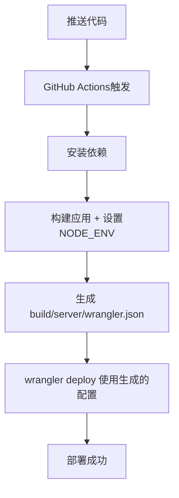

# 🛠️ Cloudflare Workers 部署配置修复

## ❌ 遇到的错误

```
Processing build/server/wrangler.json configuration:
- You have specified the environment "production", but are using a redirected configuration, produced by a build tool such as Vite.
You need to set the environment in your build tool, rather than via Wrangler.
```

## 🔍 问题分析

### 根本原因
React Router 构建时会生成重定向的 `wrangler.json` 配置文件到 `build/server/` 目录，但我们在 GitHub Actions 中仍然使用 `--env production` 参数，导致配置冲突。

### 技术背景
- React Router 使用 Vite 作为构建工具
- 构建后自动生成 Cloudflare Workers 配置
- 环境配置应该在构建时设置，而不是部署时

## ✅ 修复方案

### 1. 🔧 GitHub Actions 配置修改

**修改前**：
```yaml
- name: Deploy to Cloudflare Workers
  uses: cloudflare/wrangler-action@v3
  with:
    apiToken: ${{ secrets.CLOUDFLARE_API_TOKEN }}
    accountId: ${{ secrets.CLOUDFLARE_ACCOUNT_ID }}
    command: deploy --env ${{ github.ref == 'refs/heads/main' && 'production' || 'development' }}
```

**修改后**：
```yaml
- name: Build application
  run: pnpm run build
  env:
    NODE_ENV: ${{ github.ref == 'refs/heads/main' && 'production' || 'development' }}

- name: Deploy to Cloudflare Workers
  uses: cloudflare/wrangler-action@v3
  with:
    apiToken: ${{ secrets.CLOUDFLARE_API_TOKEN }}
    accountId: ${{ secrets.CLOUDFLARE_ACCOUNT_ID }}
    workingDirectory: .
    wranglerVersion: "4.33.1"
```

### 2. 🎯 关键变化

1. **移除 `--env` 参数**：不再在 wrangler 命令中指定环境
2. **构建时设置环境**：通过 `NODE_ENV` 在构建时确定环境
3. **使用默认部署**：让构建工具生成的配置自动处理环境
4. **固定 wrangler 版本**：确保部署一致性

### 3. 🔄 工作流程



## 📁 涉及文件

### 修改的文件
- ✅ `.github/workflows/ci.yml`
- ✅ `.github/workflows/deploy-only.yml`

### 生成的文件（构建时）
- 🔄 `build/server/wrangler.json` (自动生成)
- 🔄 `build/server/index.js` (Worker 脚本)

## 🧪 验证结果

### 本地测试
```bash
✅ pnpm run build  # 构建成功
✅ 生成 build/server/wrangler.json
✅ 无配置冲突错误
```

### 预期 GitHub Actions 结果
```
✅ Install dependencies
✅ Build application (with NODE_ENV)
✅ Deploy to Cloudflare Workers
✅ No environment configuration errors
```

## 🎯 解决的问题

1. ❌ **Environment configuration conflict** → ✅ **使用构建工具管理环境**
2. ❌ **Redirected configuration error** → ✅ **兼容重定向配置**
3. ❌ **Manual environment specification** → ✅ **自动环境检测**

## 📋 后续维护

### 环境配置
- 🌍 **生产环境**：`main` 分支自动部署
- 🔧 **开发环境**：`develop` 分支自动部署
- 🔄 **本地环境**：使用 `.dev.vars` 文件

### 部署命令
```bash
# 本地部署（开发）
pnpm run deploy:dev

# 本地部署（生产）
pnpm run deploy:prod

# GitHub Actions（自动）
git push origin main    # → 生产环境
git push origin develop # → 开发环境
```

---

**🎉 现在 Cloudflare Workers 部署应该能够正常工作，不再有环境配置冲突！**
