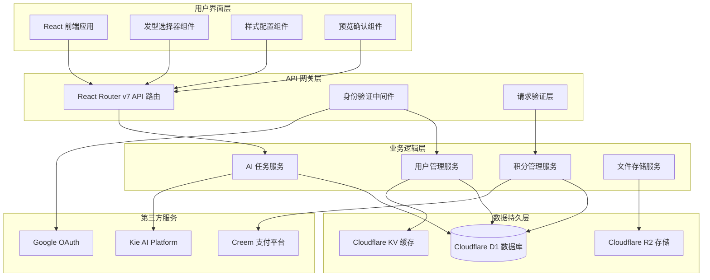
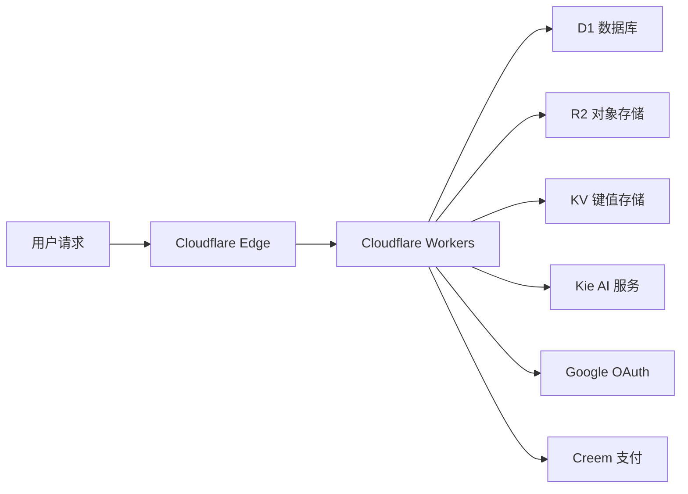
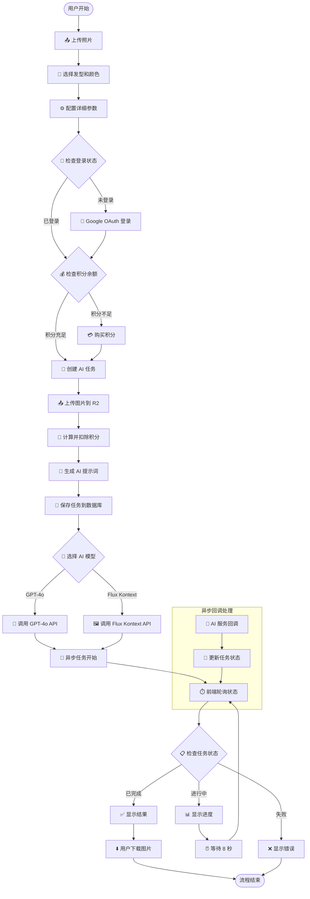

# AI 发型生成系统技术文档

> **版本**: v1.0  
> **最后更新**: 2024-12  
> **项目**: Nano Banana AI Image Generator

## 📚 目录

1. [系统概述](#系统概述)
2. [技术架构](#技术架构)
3. [工作流程](#工作流程)
4. [核心模块详解](#核心模块详解)
5. [API 接口说明](#api-接口说明)
6. [数据库设计](#数据库设计)
7. [开发指南](#开发指南)

---

## 🎯 系统概述

### 功能介绍
AI 发型生成系统基于人工智能技术，允许用户上传个人照片，通过选择不同发型样式和颜色，使用 AI 模型生成个性化发型效果图。

### 核心特性
- 🎨 **多模型支持**: GPT-4o 和 Flux Kontext 双 AI 模型
- 🔄 **异步处理**: 非阻塞式任务执行机制
- 💰 **积分系统**: 完整的付费和消费管理
- 🌐 **全球部署**: Cloudflare Workers 边缘计算
- 🔐 **安全认证**: Google OAuth 第三方登录
- 📱 **响应式设计**: 支持移动端和桌面端

### 技术栈
- **前端**: React 19 + React Router v7 + TypeScript + Tailwind CSS + DaisyUI
- **后端**: Cloudflare Workers + Drizzle ORM
- **数据库**: Cloudflare D1 (SQLite)
- **存储**: Cloudflare R2 (对象存储) + KV (缓存)
- **AI 服务**: Kie AI Platform (GPT-4o, Flux Kontext)
- **认证**: Google OAuth
- **支付**: Creem Platform

---

## 🏗️ 技术架构

### 系统架构图



### 部署架构



---

## 🔄 工作流程

### 完整业务流程图



### 技术实现流程

1. **前端交互阶段**
   - 用户上传照片文件
   - 选择发型样式和颜色配置
   - 表单验证和预览确认

2. **请求处理阶段**
   - API 路由接收 FormData
   - 身份验证和权限检查
   - 参数解析和数据验证

3. **任务创建阶段**
   - 积分余额检查和扣除
   - 文件上传到 R2 存储
   - 生成结构化 AI 提示词
   - 创建任务记录入库

4. **AI 服务调用阶段**
   - 根据模型类型调用相应 API
   - 获取任务 ID 并更新状态
   - 配置异步回调 URL

5. **异步处理阶段**
   - AI 服务后台处理图片
   - Webhook 回调更新状态
   - 结果 URL 存储到数据库

6. **状态查询阶段**
   - 前端轮询任务状态
   - 实时进度展示
   - 最终结果呈现

---

## 🧩 核心模块详解

### 1. 前端交互模块

#### 发型选择器组件 (`HairstyleChanger`)

**文件位置**: `/app/features/hairstyle_changer/index.tsx`

**核心功能**:
- 📤 文件上传和预览
- 🎯 步骤式交互流程
- 🔄 任务状态实时更新
- 📊 进度条显示

**关键代码结构**:
```typescript
export const HairstyleChanger = forwardRef<HairstyleChangerRef, HairstyleChangerProps>(
  ({ headings, types, hairstyles, colors }, ref) => {
    // 状态管理
    const [step, setStep] = useState(0);
    const [file, setFile] = useState<File>();
    const [hairstyle, setHairstyle] = useState<string[]>([]);
    const [color, setColor] = useState("");
    
    // 任务提交处理
    const handleSubmit = async () => {
      const form = new FormData();
      form.set("photo", file);
      form.set("hairstyle", JSON.stringify(checkedHairstyles));
      form.set("hair_color", JSON.stringify(checkedHairColor));
      
      const res = await fetch("/api/create/ai-hairstyle", {
        method: "post",
        body: form,
      });
      
      if (res.ok) {
        const result = await res.json<AiHairstyleResult>();
        setTasks(result.tasks.map(item => ({ ...item, progress: 0 })));
        setDone(true);
      }
    };
    
    // 组件结构
    return (
      <dialog ref={modalRef} className="modal">
        {/* 步骤式界面 */}
        {step === 0 && <HairstyleSelect />}
        {step === 1 && <StyleConfiguration />}
        {step === 2 && <ConfirmPreview />}
        {done && <ResultDisplay />}
      </dialog>
    );
  }
);
```

### 2. API 接口模块

#### 创建发型任务 API

**文件位置**: `/app/routes/_api/create.ai-hairstyle/route.ts`

```typescript
export const action = async ({ request }: Route.ActionArgs) => {
  // 1. 解析和验证请求数据
  const form = await request.formData();
  const raw = Object.fromEntries(form.entries());
  const json = createAiHairstyleSchema.parse(raw);
  
  // 2. 用户身份验证
  const [session] = await getSessionHandler(request);
  const user = session.get("user");
  if (!user) throw new Response("Unauthorized", { status: 401 });
  
  // 3. 调用业务逻辑层
  try {
    const result = await createAiHairstyle(json, user);
    return data(result);
  } catch (e) {
    console.error("Create ai hairstyle error", e);
    throw new Response("Server Error", { status: 500 });
  }
};
```

#### 任务状态查询 API

**文件位置**: `/app/routes/_api/task.$task_no/route.ts`

```typescript
export const loader = async ({ params }: Route.LoaderArgs) => {
  const taskNo = params.task_no;
  const result = await updateTaskStatus(taskNo);
  return data(result);
};
```

### 3. 业务逻辑层

#### AI 任务服务

**文件位置**: `/app/.server/services/ai-tasks.ts`

**核心函数**: `createAiHairstyle`

```typescript
export const createAiHairstyle = async (
  value: CreateAiHairstyleDTO,
  user: User
) => {
  const { photo, hair_color, hairstyle, detail, type } = value;
  
  // 1. 计算并扣除积分
  const taskCredits = hairstyle.length;
  const consumptionResult = await consumptionsCredits(user, {
    credits: taskCredits,
  });
  
  // 2. 上传文件到 R2
  const extName = photo.name.split(".").pop()!;
  const newFileName = `${nanoid()}.${extName}`;
  const file = new File([photo], newFileName);
  const [R2Object] = await uploadFiles(file);
  const fileUrl = new URL(R2Object.key, env.CDN_URL).toString();
  
  // 3. 根据模型类型生成任务参数
  let insertPayloads: InsertAiTask[] = [];
  
  if (type === "gpt-4o") {
    insertPayloads = hairstyle.map<InsertAiTask>((style) => ({
      user_id: user.id,
      status: "pending",
      estimated_start_at: new Date(),
      input_params: { photo: fileUrl, hair_color, hairstyle: style, detail },
      ext: { hairstyle: style.name, haircolor: hair_color.name },
      aspect: "2:3",
      provider: "kie_4o",
      request_param: {
        filesUrl: [fileUrl, style.cover, hair_color.cover].filter(Boolean),
        prompt: createAiHairstyleChangerPrompt({
          hairstyle: style.name,
          haircolor: hair_color.name,
          haircolorHex: hair_color.value,
          withStyleReference: !!style.cover,
          withColorReference: !!hair_color.cover,
          detail: detail,
        }),
        size: "2:3",
        nVariants: "4",
        callBackUrl: `${env.DOMAIN}/webhooks/kie-image`,
      },
    }));
  }
  
  // 4. 批量创建任务
  const tasks = await createAiTask(insertPayloads);
  return { tasks, consumptionCredits: consumptionResult };
};
```

### 4. AI 提示词生成

**文件位置**: `/app/.server/prompt/ai-hairstyle.ts`

```typescript
export const createAiHairstyleChangerPrompt = ({
  hairstyle,
  haircolor,
  haircolorHex,
  withStyleReference,
  withColorReference,
  detail,
}: CreateAiHairstyleChangerPromptOptions) => {
  const prompt: string[] = [];
  
  // 基础发型修改指令
  if (haircolor) {
    prompt.push(
      `Change the current hairstyle to a ${hairstyle} with ${haircolor} hair color${
        haircolorHex ? ` (hex: ${haircolorHex}).` : "."
      }`
    );
  } else {
    prompt.push(
      `Change the current hairstyle to a ${hairstyle} and keep the person hair color and skin tone.`
    );
  }
  
  // 参考图片说明
  if (withStyleReference) {
    prompt.push(
      "Use the second image attachment as the hairstyle reference."
    );
  }
  
  // 保持面部特征
  prompt.push(
    "Keep the person's face, facial features, and expression exactly the same.",
    "The new hairstyle should look natural and realistic."
  );
  
  // 自定义要求
  if (detail) {
    prompt.push("", "Special Requests", detail);
  }
  
  return prompt.join("\n");
};
```

### 5. AI 服务集成

**文件位置**: `/app/.server/aisdk/kie-ai/index.ts`

```typescript
export class KieAI {
  private API_URL = new URL("https://kieai.erweima.ai");
  private readonly config = { accessKey: env.KIEAI_APIKEY };
  
  // GPT-4o 任务创建
  async create4oTask(payload: Create4oTaskOptions) {
    const result = await this.fetch<CreateTaskResult>(
      "/api/v1/gpt4o-image/generate",
      payload,
      { method: "post" }
    );
    return result.data;
  }
  
  // Flux Kontext 任务创建
  async createKontextTask(payload: CreateKontextOptions) {
    const result = await this.fetch<CreateTaskResult>(
      "/api/v1/flux/kontext/generate",
      payload,
      { method: "post" }
    );
    return result.data;
  }
  
  // 任务状态查询
  async query4oTaskDetail(params: QueryTaskParams) {
    const result = await this.fetch<GPT4oTask>(
      "/api/v1/gpt4o-image/record-info",
      params
    );
    return result.data;
  }
}
```

---

## 📝 开发指南

### 本地开发环境搭建

1. **克隆项目**
```bash
git clone <repository-url>
cd nanobananaimageqoder
```

2. **安装依赖**
```bash
pnpm install
```

3. **配置环境变量**
编辑 `wrangler.jsonc`:
```json
{
  "vars": {
    "KIEAI_APIKEY": "your_kie_ai_api_key",
    "GOOGLE_CLIENT_ID": "your_google_client_id",
    "GOOGLE_CLIENT_SECRET": "your_google_client_secret"
  }
}
```

4. **数据库迁移**
```bash
pnpm run db:migrate:local
```

5. **启动开发服务器**
```bash
pnpm run dev
```

### 常用命令

- `pnpm run dev` - 启动开发服务器
- `pnpm run build` - 构建项目
- `pnpm run deploy` - 部署到 Cloudflare Workers
- `pnpm run db:migrate` - 执行数据库迁移
- `pnpm run cf-typegen` - 生成 Cloudflare 类型定义

### 调试指南

1. **前端调试**: 使用浏览器开发者工具
2. **API 调试**: 查看 Cloudflare Workers 日志
3. **数据库调试**: 使用 Drizzle Studio 或 D1 控制台
4. **AI 服务调试**: 检查 Kie AI 平台日志

---

## 🔧 故障排查

### 常见问题

1. **端口占用问题**
```bash
# 查找占用进程
lsof -i :3004
# 杀死进程
kill -9 <PID>
```

2. **Miniflare 依赖缺失**
```bash
pnpm install miniflare --save-dev
```

3. **数据库连接问题**
- 检查 wrangler.jsonc 配置
- 确认 D1 数据库已创建
- 执行数据库迁移

4. **AI 服务调用失败**
- 验证 API 密钥配置
- 检查网络连接
- 查看服务状态

### 性能优化建议

1. **前端优化**
   - 图片压缩和懒加载
   - 代码分割和按需加载
   - 缓存策略优化

2. **后端优化**
   - 数据库查询优化
   - API 响应缓存
   - 文件上传优化

3. **部署优化**
   - CDN 配置
   - 边缘缓存策略
   - 监控和告警

---

*文档持续更新中，如有问题请联系开发团队*