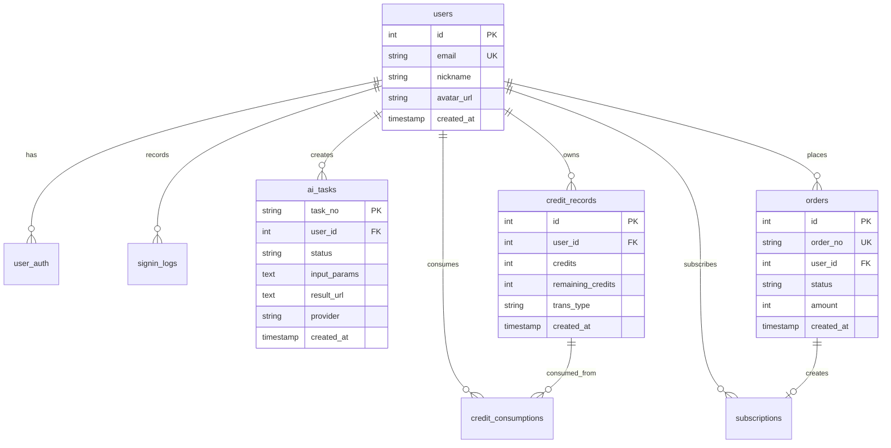

# AI 发型生成系统 - API 与数据库设计文档

> **版本**: v1.0  
> **最后更新**: 2024-12  
> **项目**: Nano Banana AI Image Generator

## 📚 目录

1. [API 接口详细说明](#api-接口详细说明)
2. [数据库设计](#数据库设计)
3. [代码文件结构](#代码文件结构)
4. [错误处理机制](#错误处理机制)
5. [安全措施](#安全措施)

---

## 📊 API 接口详细说明

### 认证相关接口

#### 用户登录验证
- **接口**: `POST /api/auth`
- **功能**: 处理 Google OAuth 登录验证
- **Content-Type**: `application/json`
- **参数**:
  ```typescript
  {
    credential: string; // Google OAuth JWT Token
  }
  ```
- **返回**:
  ```typescript
  {
    user: {
      id: number;
      email: string;
      nickname: string;
      avatar_url: string;
    };
    session: string;
  }
  ```

### 任务管理接口

#### 创建发型生成任务
- **接口**: `POST /api/create/ai-hairstyle`
- **功能**: 创建新的 AI 发型生成任务
- **Content-Type**: `multipart/form-data`
- **认证**: 需要用户登录
- **参数**:
  ```typescript
  {
    photo: File;           // 用户上传的照片文件
    hairstyle: string;     // JSON 序列化的发型样式数组
    hair_color: string;    // JSON 序列化的颜色配置对象
    detail?: string;       // 用户自定义详细要求
    type?: "gpt-4o" | "kontext"; // AI 模型类型，默认 "gpt-4o"
  }
  ```
- **返回成功**:
  ```typescript
  {
    tasks: Array<{
      task_no: string;        // 任务编号
      status: "pending";      // 任务状态
      created_at: string;     // 创建时间
      aspect: string;         // 图片宽高比
      ext: {                  // 扩展信息
        hairstyle: string;
        haircolor?: string;
      };
    }>;
    consumptionCredits: {
      remainingBalance: number;  // 剩余积分
      consumedCredits: number;   // 消耗积分
      creditRecordId: number;    // 积分记录ID
    };
  }
  ```
- **错误响应**:
  - `401`: 用户未登录
  - `400`: 参数验证失败
  - `402`: 积分不足
  - `500`: 服务器内部错误

#### 查询任务状态和进度
- **接口**: `GET /api/task/:task_no`
- **功能**: 查询指定任务的状态和进度
- **认证**: 不需要（公开接口）
- **参数**: 
  - `task_no` (路径参数): 任务编号
- **返回**:
  ```typescript
  {
    task: {
      task_no: string;
      status: "pending" | "running" | "succeeded" | "failed";
      created_at: string;
      started_at?: string;
      completed_at?: string;
      result_url?: string;    // 生成结果图片 URL
      fail_reason?: string;   // 失败原因
      aspect: string;
      ext: Record<string, any>;
    };
    progress: number;         // 进度百分比 (0-100)
  }
  ```

### 订单和支付接口

#### 创建支付订单
- **接口**: `POST /api/create-order`
- **功能**: 创建积分购买订单
- **Content-Type**: `application/json`
- **认证**: 需要用户登录
- **参数**:
  ```typescript
  {
    product_id: string;     // 商品 ID
    credits: number;        // 积分数量
    price: number;          // 价格（分）
    currency: string;       // 货币类型
  }
  ```
- **返回**:
  ```typescript
  {
    order_no: string;       // 订单编号
    checkout_url: string;   // 支付页面 URL
    amount: number;         // 支付金额
    expires_at: string;     // 订单过期时间
  }
  ```

### Webhook 接口

#### AI 服务回调接口
- **接口**: `POST /api/webhooks/kie-image`
- **功能**: 接收 Kie AI 服务的异步处理结果
- **认证**: 通过 API 密钥验证
- **参数**:
  ```typescript
  {
    data: {
      taskId: string;       // AI 服务任务 ID
      status: string;       // 任务状态
      result?: {
        urls: string[];     // 结果图片 URL 数组
      };
      error?: string;       // 错误信息
    };
  }
  ```

#### 支付成功回调
- **接口**: `POST /api/webhooks/payment`
- **功能**: 处理支付平台的成功回调
- **认证**: 通过签名验证
- **参数**: Creem 支付平台回调数据

---

## 🗄️ 数据库设计

### 表结构详细说明

#### 用户系统表

**users** - 用户基本信息表
```sql
CREATE TABLE users (
  id INTEGER PRIMARY KEY AUTOINCREMENT,
  email TEXT NOT NULL UNIQUE,           -- 用户邮箱
  password TEXT,                        -- 密码（第三方登录可为空）
  nickname TEXT NOT NULL,               -- 昵称
  avatar_url TEXT,                      -- 头像 URL
  created_at INTEGER NOT NULL DEFAULT (strftime('%s', 'now'))
);

CREATE INDEX email_unique_idx ON users(email);
```

**user_auth** - 第三方登录信息表
```sql
CREATE TABLE user_auth (
  id INTEGER PRIMARY KEY AUTOINCREMENT,
  user_id INTEGER NOT NULL REFERENCES users(id) ON DELETE CASCADE,
  provider TEXT NOT NULL,               -- 登录提供商 (google, facebook 等)
  openid TEXT NOT NULL,                 -- 第三方平台用户 ID
  created_at INTEGER NOT NULL DEFAULT (strftime('%s', 'now'))
);
```

**signin_logs** - 登录日志表
```sql
CREATE TABLE signin_logs (
  id INTEGER PRIMARY KEY AUTOINCREMENT,
  session TEXT,                         -- Session ID
  user_id INTEGER NOT NULL REFERENCES users(id) ON DELETE CASCADE,
  type TEXT NOT NULL,                   -- 登录类型 (email, google)
  ip TEXT,                              -- 登录 IP
  user_agent TEXT,                      -- 用户代理
  headers TEXT,                         -- 请求头 JSON
  created_at INTEGER NOT NULL DEFAULT (strftime('%s', 'now'))
);
```

#### 任务系统表

**ai_tasks** - AI 任务核心表
```sql
CREATE TABLE ai_tasks (
  task_no TEXT PRIMARY KEY,             -- 任务编号（使用 nanoid 生成）
  user_id INTEGER REFERENCES users(id) ON DELETE CASCADE,
  created_at INTEGER NOT NULL DEFAULT (strftime('%s', 'now')),
  
  -- 任务状态和时间
  status TEXT NOT NULL DEFAULT 'pending' 
    CHECK (status IN ('pending', 'running', 'succeeded', 'failed')),
  estimated_start_at INTEGER NOT NULL,  -- 预计开始时间
  started_at INTEGER,                   -- 实际开始时间
  completed_at INTEGER,                 -- 完成时间
  
  -- 任务参数和结果
  input_params TEXT NOT NULL,           -- 用户输入参数 (JSON)
  ext TEXT NOT NULL DEFAULT '{}',       -- 扩展信息 (JSON)
  aspect TEXT DEFAULT '1:1',            -- 图片宽高比
  result_url TEXT,                      -- 结果图片 URL
  fail_reason TEXT,                     -- 失败原因
  
  -- 外部服务相关
  provider TEXT CHECK (provider IN ('kie_4o', 'kie_kontext')),
  task_id TEXT,                         -- 外部系统任务 ID
  request_param TEXT,                   -- 调用外部 API 的参数 (JSON)
  result_data TEXT                      -- 外部系统返回的原始数据 (JSON)
);
```

#### 积分系统表

**credit_records** - 积分获取记录表
```sql
CREATE TABLE credit_records (
  id INTEGER PRIMARY KEY AUTOINCREMENT,
  user_id INTEGER NOT NULL REFERENCES users(id) ON DELETE CASCADE,
  credits INTEGER NOT NULL,             -- 获得的积分数量
  remaining_credits INTEGER NOT NULL,   -- 当前剩余积分
  trans_type TEXT NOT NULL CHECK (trans_type IN 
    ('initilize', 'purchase', 'subscription', 'adjustment')),
  source_type TEXT,                     -- 来源类型 (order, subscription)
  source_id TEXT,                       -- 来源 ID
  expired_at INTEGER,                   -- 有效期
  note TEXT,                            -- 备注
  created_at INTEGER NOT NULL DEFAULT (strftime('%s', 'now')),
  updated_at INTEGER NOT NULL DEFAULT (strftime('%s', 'now'))
);
```

**credit_consumptions** - 积分消费记录表
```sql
CREATE TABLE credit_consumptions (
  id INTEGER PRIMARY KEY AUTOINCREMENT,
  user_id INTEGER NOT NULL REFERENCES users(id) ON DELETE CASCADE,
  credits INTEGER NOT NULL,             -- 消耗的积分数量
  credit_record_id INTEGER NOT NULL REFERENCES credit_records(id) ON DELETE CASCADE,
  source_type TEXT,                     -- 消耗来源类型 (ai_task)
  source_id TEXT,                       -- 消耗来源 ID (task_no)
  reason TEXT,                          -- 消耗原因
  created_at INTEGER NOT NULL DEFAULT (strftime('%s', 'now'))
);
```

#### 订单系统表

**orders** - 订单信息表
```sql
CREATE TABLE orders (
  id INTEGER PRIMARY KEY AUTOINCREMENT,
  order_no TEXT UNIQUE NOT NULL,        -- 订单编号
  user_id INTEGER NOT NULL REFERENCES users(id) ON DELETE CASCADE,
  
  -- 商品信息
  product_id TEXT NOT NULL,             -- 商品 ID
  product_name TEXT NOT NULL,           -- 商品名称
  amount INTEGER NOT NULL,              -- 支付金额（分）
  order_detail TEXT,                    -- 订单详情 (JSON)
  
  -- 订单状态
  status TEXT NOT NULL CHECK (status IN (
    'pending', 'paid', 'processing', 'completed', 
    'refunding', 'refunded', 'cancelled', 'expired'
  )),
  
  -- 支付信息
  pay_session_id TEXT UNIQUE,           -- 支付会话 ID
  pay_provider TEXT DEFAULT 'creem' CHECK (pay_provider IN ('creem')),
  session_detail TEXT,                  -- 支付会话详情 (JSON)
  paid_at INTEGER,                      -- 支付时间
  paid_email TEXT,                      -- 支付邮箱
  paid_detail TEXT,                     -- 支付详情 (JSON)
  
  -- 错误信息
  is_error INTEGER DEFAULT 0,           -- 是否有错误
  error_msg TEXT,                       -- 错误消息
  
  -- 订阅相关
  sub_id TEXT,                          -- 第三方订阅 ID
  subscription_id INTEGER REFERENCES subscriptions(id) ON DELETE SET NULL,
  
  created_at INTEGER NOT NULL DEFAULT (strftime('%s', 'now'))
);
```

**subscriptions** - 订阅信息表
```sql
CREATE TABLE subscriptions (
  id INTEGER PRIMARY KEY AUTOINCREMENT,
  user_id INTEGER NOT NULL REFERENCES users(id) ON DELETE CASCADE,
  plan_type TEXT NOT NULL,              -- 订阅计划类型
  status TEXT NOT NULL CHECK (status IN ('active', 'cancelled', 'expired')),
  interval TEXT DEFAULT 'month' CHECK (interval IN ('month', 'year')),
  interval_count INTEGER DEFAULT 1,     -- 周期间隔
  platform_sub_id TEXT,                -- 第三方平台订阅 ID
  start_at INTEGER DEFAULT (strftime('%s', 'now')),
  expired_at INTEGER,                   -- 到期时间
  last_payment_at INTEGER,              -- 最近支付时间
  cancel_at INTEGER,                    -- 取消时间
  created_at INTEGER NOT NULL DEFAULT (strftime('%s', 'now'))
);
```

### 数据库关系图



---

## 📁 代码文件结构

### 完整目录结构

```
app/
├── .server/                           # 服务端代码 (Cloudflare Workers 专用)
│   ├── aisdk/                         # AI 服务 SDK 封装
│   │   └── kie-ai/
│   │       ├── index.ts               # Kie AI 主要接口
│   │       └── type.ts                # 类型定义
│   ├── constants/                     # 常量定义
│   │   ├── product.ts                 # 商品配置
│   │   └── credits.ts                 # 积分配置
│   ├── drizzle/                       # 数据库配置和迁移
│   │   ├── migrations/                # 数据库迁移文件
│   │   ├── config.ts                  # 数据库连接配置
│   │   └── schema.ts                  # 数据表结构定义
│   ├── libs/                          # 工具库和通用服务
│   │   ├── creem/                     # Creem 支付平台集成
│   │   ├── markdown/                  # Markdown 渲染器
│   │   ├── db.ts                      # 数据库连接器
│   │   ├── session.ts                 # 用户会话管理
│   │   └── upload.ts                  # 文件上传服务
│   ├── model/                         # 数据模型层 (数据库操作)
│   │   ├── ai-tasks.ts                # AI 任务数据操作
│   │   ├── users.ts                   # 用户数据操作
│   │   └── credits.ts                 # 积分数据操作
│   ├── prompt/                        # AI 提示词模板
│   │   ├── ai-hairstyle.ts            # GPT-4o 发型提示词
│   │   └── ai-hairstyle-kontext.ts    # Flux Kontext 发型提示词
│   ├── schema/                        # 数据验证 Schema
│   │   ├── task.ts                    # 任务相关数据验证
│   │   └── auth.ts                    # 认证相关数据验证
│   └── services/                      # 业务逻辑层
│       ├── ai-tasks.ts                # AI 任务业务逻辑
│       ├── auth.ts                    # 认证业务逻辑
│       ├── credits.ts                 # 积分业务逻辑
│       └── orders.ts                  # 订单业务逻辑
├── components/                        # React 组件
│   ├── common/                        # 通用组件
│   │   ├── image.tsx                  # 图片组件
│   │   ├── link.tsx                   # 链接组件
│   │   └── logo.tsx                   # Logo 组件
│   ├── icons/                         # 图标组件
│   ├── pages/                         # 页面组件
│   │   ├── landing/                   # 着陆页组件
│   │   └── legal/                     # 法律页面组件
│   └── ui/                            # UI 组件
│       ├── drag-drop-upload.tsx       # 拖拽上传组件
│       └── progress-bar.tsx           # 进度条组件
├── features/                          # 业务功能模块
│   ├── document/                      # 文档功能
│   ├── hairstyle_changer/             # 发型修改核心功能
│   │   ├── index.tsx                  # 主组件
│   │   ├── hairstyle-select.tsx       # 发型选择组件
│   │   ├── style-configuration.tsx    # 样式配置组件
│   │   └── confirm-preview.tsx        # 确认预览组件
│   ├── image_generator/               # 图片生成功能 (新增)
│   │   ├── index.tsx                  # 主组件
│   │   └── types.ts                   # 类型定义
│   ├── layout/                        # 布局组件
│   └── oauth/                         # OAuth 认证功能
│       ├── index.tsx                  # Google OAuth 组件
│       └── types.ts                   # 类型定义
├── hooks/                             # React Hooks
│   ├── data/                          # 数据相关 Hooks
│   │   ├── use-tasks.ts               # 任务状态管理 Hook
│   │   └── use-credits.ts             # 积分管理 Hook
│   └── dom/                           # DOM 操作 Hooks
├── routes/                            # 路由目录 (React Router v7 文件路由)
│   ├── _api/                          # API 路由端点
│   │   ├── auth/                      # 认证相关 API
│   │   │   └── route.ts               # 登录验证 API
│   │   ├── create-order/              # 订单创建 API
│   │   │   └── route.ts
│   │   ├── create.ai-hairstyle/       # AI 发型生成 API
│   │   │   └── route.ts
│   │   ├── create.ai-image/           # AI 图片生成 API (新增)
│   │   │   └── route.ts
│   │   └── task.$task_no/             # 任务状态查询 API
│   │       └── route.ts
│   ├── _callback/                     # 支付回调路由
│   │   └── payment/
│   │       └── route.ts
│   ├── _legal/                        # 法律文档页面
│   │   ├── privacy/
│   │   └── terms/
│   ├── _meta/                         # SEO 相关文件
│   │   ├── [sitemap.xml].tsx          # 站点地图
│   │   └── [robots.txt].tsx           # 机器人协议
│   ├── _webhooks/                     # Webhook 端点
│   │   ├── kie-image/                 # AI 服务回调
│   │   │   └── route.ts
│   │   └── payment/                   # 支付回调
│   │       └── route.ts
│   └── base/                          # 基础页面路由
│       ├── _index/                    # 首页
│       │   ├── route.tsx
│       │   └── config.ts              # 页面配置
│       └── dashboard/                 # 用户仪表板
├── store/                             # Zustand 状态管理
│   ├── index.ts                       # 状态管理入口
│   ├── user.ts                        # 用户状态
│   └── app.ts                         # 应用状态
└── utils/                             # 工具函数
    ├── meta.ts                        # SEO Meta 工具
    ├── format.ts                      # 格式化工具
    └── validation.ts                  # 验证工具
```

### 关键文件说明

#### 核心业务逻辑文件
- **`/app/.server/services/ai-tasks.ts`**: AI 任务的核心业务逻辑
- **`/app/features/hairstyle_changer/index.tsx`**: 发型修改器主组件
- **`/app/routes/_api/create.ai-hairstyle/route.ts`**: 创建发型任务 API

#### 配置和工具文件
- **`/app/.server/drizzle/schema.ts`**: 数据库表结构定义
- **`/app/.server/aisdk/kie-ai/index.ts`**: AI 服务 SDK 封装
- **`/app/.server/prompt/ai-hairstyle.ts`**: AI 提示词生成逻辑

#### 前端交互文件
- **`/app/features/hairstyle_changer/`**: 发型修改相关的所有 UI 组件
- **`/app/hooks/data/use-tasks.ts`**: 任务状态管理 Hook
- **`/app/store/user.ts`**: 用户状态管理

---

## ⚠️ 错误处理机制

### API 错误响应格式

```typescript
// 标准错误响应
interface ErrorResponse {
  error: string;          // 错误代码
  message: string;        // 错误描述
  details?: any;          // 详细错误信息
  timestamp: string;      // 错误时间
}
```

### 常见错误代码

- **`400 Bad Request`**: 请求参数错误
- **`401 Unauthorized`**: 用户未登录或 Token 无效
- **`402 Payment Required`**: 积分不足
- **`403 Forbidden`**: 权限不足
- **`404 Not Found`**: 资源不存在
- **`429 Too Many Requests`**: 请求频率限制
- **`500 Internal Server Error`**: 服务器内部错误
- **`503 Service Unavailable`**: 服务暂时不可用

### 前端错误处理

```typescript
// 统一错误处理函数
const handleApiError = (error: any) => {
  switch (error.status) {
    case 401:
      // 跳转到登录页
      loginRef.current?.login();
      break;
    case 402:
      // 提示购买积分
      showCreditsPurchaseModal();
      break;
    case 500:
      // 显示服务器错误提示
      showErrorToast("服务器暂时不可用，请稍后重试");
      break;
    default:
      showErrorToast(error.message || "操作失败");
  }
};
```

---

## 🔒 安全措施

### 身份验证
- Google OAuth 2.0 第三方登录
- JWT Token 验证
- Session 管理通过 Cloudflare KV

### 数据保护
- 用户照片处理完成后自动删除
- 敏感信息加密存储
- API 密钥通过环境变量管理

### 访问控制
- API 接口级别的权限验证
- 用户数据隔离
- 请求频率限制

### 支付安全
- Webhook 签名验证
- 订单状态一致性检查
- 支付数据加密传输

---

*此文档与主要技术文档配套使用，提供详细的 API 和数据库设计参考*